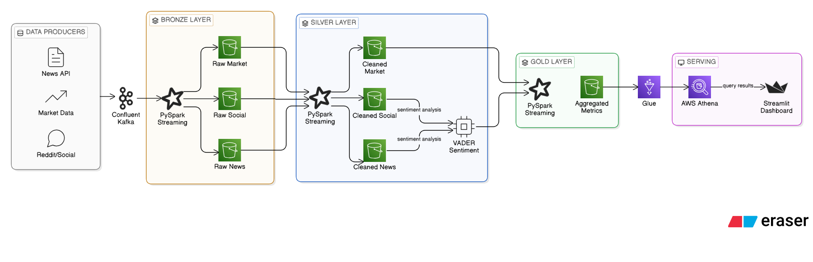

# Real-time Market Sentiment Data Lakehouse

This project implements a **Medallion Architecture** to analyze correlations between market movements and social/news sentiment. The dashboard to visualize the data is available [here](https://realtime-market-sentiment-data-montanaro.streamlit.app/).

> **Note on Deployment**: To have zero cloud costs, the hosted Streamlit dashboard displays a **static 20-minute snapshot** of a high-density simulation rather than a continuous live stream.

## System Architecture

The pipeline follows the **Medallion Architecture** to ensure data integrity and progressive enrichment:

1.  **Ingestion (Bronze)**: Raw data is ingested from Kafka into S3 as plain Parquets files. No transformations are applied at this stage to preserve data lineage.
2.  **Processing (Silver)**: 
    * **Data Format Transformation**: Data now is saved in Delta Lake format.
    * **Data Cleaning**: Schema enforcement and deduplication.
    * **NLP Engine**: Sentiment analysis using **VADER**, optimized for financial jargon and social media intensity.
3.  **Analytics (Gold)**: 
    * Time-windowed aggregations (1-minute).
    * Metric calculation: **VWAP**, **Volatility**, and **RVOL**.
    * Join operations between market data, news, and social sentiment.
4.  **Serving**: Data is queried via **AWS Athena** and visualized on **Streamlit**.

---

## Data Producers

The system supports multiple producer modes to test different scenarios:

| Producer | Data Source | Characteristics |
| :--- | :--- | :--- |
| `demo_producer.py` | **Mock/Synthetic** | Designed for the demo. Uses "Regimes" (Bull/Neutral/Bear) to emphasize rapid price/sentiment changes. |
| `hybrid_yf_producer.py` | **YFinance + Noise** | Starts with real Yahoo Finance data and injects 1-second synthetic noise for high-density testing. |
| `yf_producer.py` | **Yahoo Finance** | Legacy producer using real-world 1-minute interval data. |
| `news_producer.py` | **Real News API** | Real financial news (1-day delay due to NewsAPI Free Tier constraints). |
| `reddit_producer.py` | **Historical CSV** | Real Reddit posts from a 2021 dataset for authentic social sentiment analysis. |

---

## Key Metrics Calculated

* **VWAP (Volume Weighted Average Price)**:
    $$VWAP = \frac{\sum (Price_i \times Volume_i)}{\sum Volume_i}$$
* **Sentiment Gap**: The delta between Institutional (News) and Retail (Social) sentiment.
* **RVOL (Relative Volume)**: Comparing current volume to the 24h historical average.
